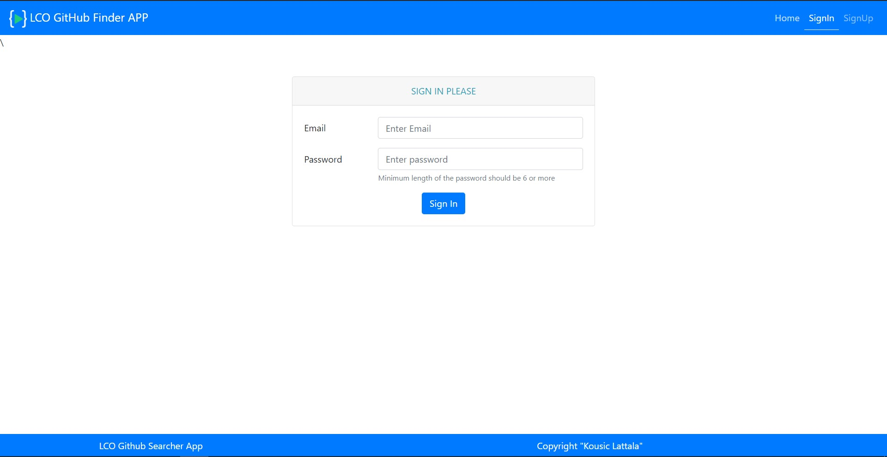
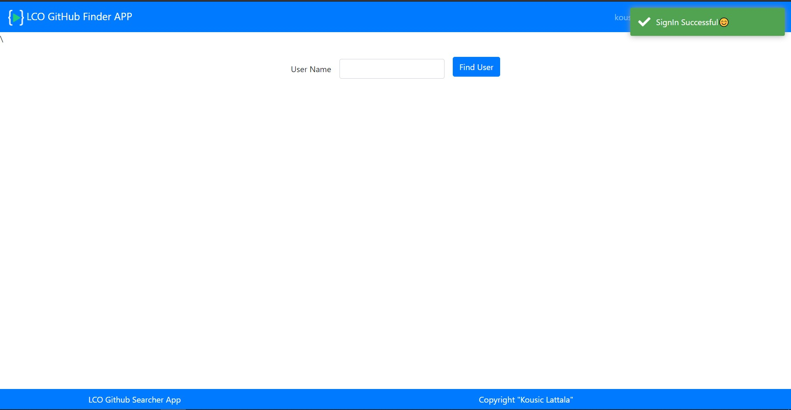
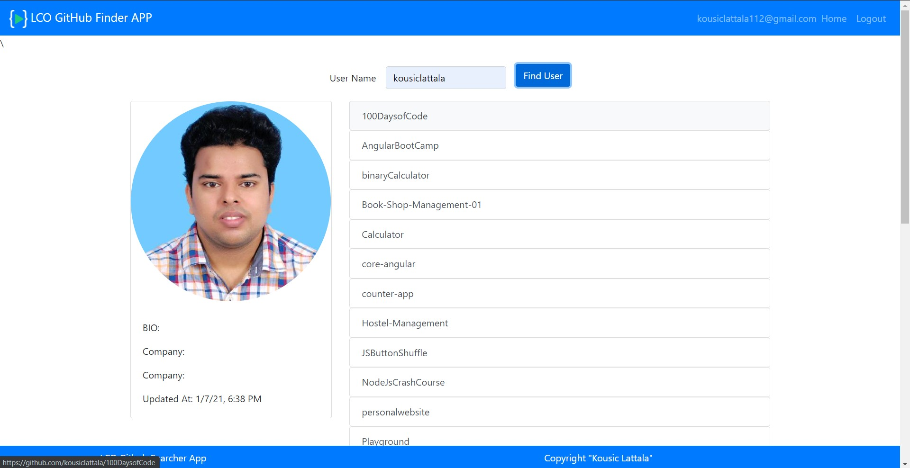
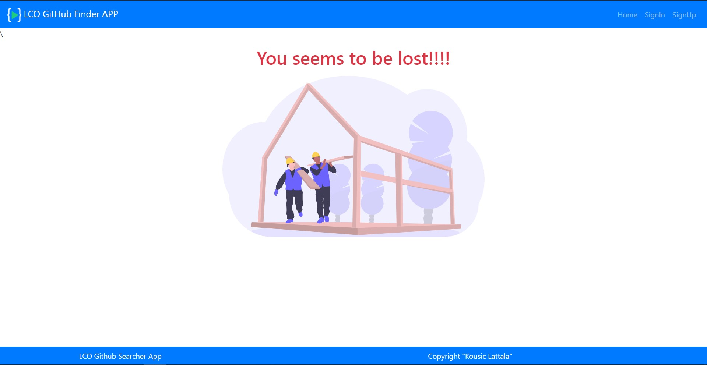

# GithubLoginFirebase

## About

This is a GitHub Searcher APP, using Github API.

## Topics Used/Learned

- Google `Firebase`(for authentication).
- Angular Routing
- Angular Fire (open-source repo) to use angular in firebase.
- Change Detection,using `ChangeDetectorRef` method which was given by `@angular/core`,when there is a data transfer from Parent Component to Grandchild Component .
- Basic debugging

## Project Images

- SignIn Page.
  

- HomePage.
  

- Searched User GitHub Repo Data in HomePage.
  

- Un-Authorized Access Page (when user enters a wrong url this page will be displayed).
  

This project was generated with [Angular CLI](https://github.com/angular/angular-cli) version 11.0.5.

## Development server

Run `ng serve` for a dev server. Navigate to `http://localhost:4200/`. The app will automatically reload if you change any of the source files.

## Note:

- To run this project, after cloning into your computer run `npm install`, it will install all the required dependencies.
- To run the server, execute the command mentioned in `Development server` above.
- Include Your Firebase Details in `environment.ts` file located at `src/environments/environment.ts`. So that you can use firebase auth service.
